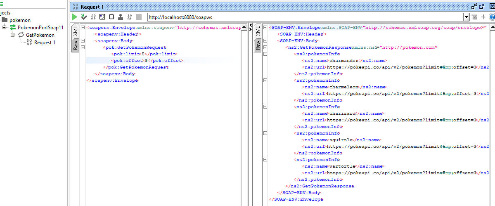

## Pokemon Api
<b style='color:darkgreen'>Pokemon Application</b>

>Java Application with three-tier architecture which allows consumption of a RestFull API  and returns paginated results.

### Tools:
Java, SpringBoot, Maven, Intellij, SoapUi

### URLS
### API RESTful: https://pokeapi.co/api/v2/pokemon
### SOAP LOCAL ENV: http://localhost:8080/soapws

### [Download WSDL](src/main/resources/docs/pokemon.wsdl)

### Screem SoapUI
